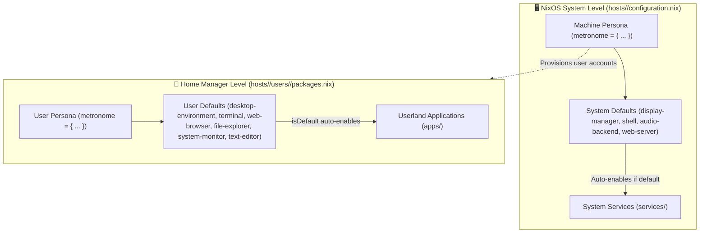

# ⏱️ Metronome — Modular NixOS & Home Manager Configuration

A clean, declarative, and hierarchical NixOS configuration powered by **Flakes** and **Home Manager**.

Rather than managing scattered package lists and disjointed boolean flags, this repository organizes the operating system around **Metronome**: a unified, intent-driven architecture that cleanly separates **machine-level system concerns** from **per-user environments**, while enabling flexible **role-based defaults and bundle overrides**.

---

## 🏛️ The Metronome Design Philosophy

Metronome is built on three core architectural principles:

### 1. The Clean System vs. User Split (True Multi-User Ready)
- **NixOS (`configuration.nix`) manages the Machine**:
  Hardware drivers, filesystems, networking, system daemons (`greetd`, `pipewire`, `docker`, `nginx`), and system shells (`fish`, `starship`).
- **Home Manager (`users/<name>/packages.nix`) manages the Person**:
  Desktop environment configs, user default handlers (`terminal`, `web-browser`, `file-explorer`), dotfiles, and individual user tools.
- **No Hardcoded Usernames**: Apps and services do not hardcode `/home/stranger` or `home-manager.users.${username}`. Every user profile is self-contained.

### 2. Role-Based Defaults + App Extras Pattern
When you select a default (e.g. `defaults.terminal = "kitty"` or `defaults.desktop-environment = "hyprland"`), Metronome automatically:
1. Enables and provisions that application.
2. Directs desktop keybindings and XDG handlers to launch it.
3. Allows installing secondary applications alongside it without changing the default (e.g. `defaults.web-browser = "google-chrome"` with `apps.firefox.enable = true`).

### 3. Nullable Defaults for Optional Tools
Essential desktop components (terminal, file manager) have defaults provided by the window manager or user. Optional tool categories (like `system-monitor`) use `lib.types.nullOr` so that software like `btop` is **never installed unprompted** on minimal servers or laptops unless explicitly selected.

---

## 📐 Architecture Overview



---

## 📂 Repository Layout

```text
/etc/nixos/
├── flake.nix                          # Master orchestrator: inputs, host declarations, and user bindings
├── flake.lock                         # Pinned dependency lockfile
├── README.md                          # Repository documentation and architectural guide
│
├── modules/                           # Central Metronome schema (options.metronome.defaults.*)
│   └── default.nix                    # Declarations for system & user defaults (shell, browser, terminal, etc.)
│
├── services/                          # NixOS System-Level Services & Daemons
│   ├── default.nix                    # System services aggregator
│   ├── docker.nix                     # Docker container runtime daemon
│   ├── fish.nix                       # System-wide Fish login shell
│   ├── greetd.nix                     # Lightweight tuigreet display manager
│   ├── hyprland.nix                   # System-level Hyprland compositing, polkit, portals, UWSM
│   ├── nginx.nix                      # Web server daemon
│   ├── ollama.nix                     # Ollama local LLM inference engine
│   ├── pipewire.nix                   # PipeWire audio server & real-time scheduling
│   ├── postgresql.nix                 # Relational database service
│   ├── ssh.nix                        # System-wide SSH-agent socket activation
│   ├── starship.nix                   # System-wide Starship prompt integration
│   └── steam.nix                      # Steam hardware integration & firewall rules
│
├── apps/                              # Home Manager User Applications & Dotfiles
│   ├── default.nix                    # Applications aggregator (all apps imported automatically)
│   ├── antigravity.nix                # Antigravity CLI agent
│   ├── btop.nix                       # TUI system monitor
│   ├── bun.nix                        # Bun JavaScript runtime
│   ├── direnv.nix                     # Direnv + nix-direnv shell integration
│   ├── git.nix                        # Git client with per-user name/email options
│   ├── google-chrome.nix              # Web browser
│   ├── hyprland/                      # Hyprland user config (hyprland.lua, keybinds, monitors)
│   ├── kitty/                         # Kitty terminal emulator config and styling
│   ├── mpd.nix                        # MPD music player daemon (user-space PipeWire & MPRIS)
│   ├── mpv.nix                        # Hardware-accelerated media player
│   ├── nautilus.nix                   # GNOME file manager
│   ├── neovim/                        # Neovim plugins, language servers, and Lua config
│   ├── nodejs.nix                     # Node.js runtime
│   ├── pavucontrol.nix                # Audio volume control GUI
│   ├── posting.nix                    # TUI HTTP client
│   ├── pwvucontrol.nix                # Native PipeWire volume control
│   ├── quickshell.nix                 # Modern desktop shell & widgets
│   ├── ssh.nix                        # User SSH client config & auto Ed25519 key generation
│   ├── swayimg/                       # Lightweight image viewer with custom Lua bindings
│   └── thunar.nix                     # Thunar file manager with archive & volume plugins
│
├── hosts/                             # Machine-Specific Profiles
│   ├── desktop/                       # Main Workstation ("desktop")
│   │   ├── configuration.nix          # System-level services and machine defaults
│   │   ├── networking.nix             # Hostname, static nameservers, firewall rules
│   │   ├── filesystem.nix             # Btrfs pools, subvolumes, and swapfile
│   │   └── users/
│   │       └── stranger/              # User profile on desktop
│   │           ├── default.nix        # System account + Home Manager entry point
│   │           ├── packages.nix       # User default selections and enabled apps
│   │           └── theme.nix          # GTK theme, Papirus icons, and dconf settings
│   │
│   └── thinkpad-p16-gen2/             # Laptop Profile ("thinkpad-p16-gen2")
│       ├── configuration.nix          # System-level services and laptop defaults
│       ├── hardware-configuration.nix # Hardware scan (partitions, Intel microcode)
│       ├── networking.nix             # Hostname and firewall
│       └── users/
│           └── stranger/              # User profile on ThinkPad
│               ├── default.nix        # System account + Home Manager entry point
│               ├── packages.nix       # User default selections and enabled apps
│               └── theme.nix          # GTK theme, Papirus icons, and dconf settings
│
├── common/                            # Shared Universal System Configurations
│   ├── nixos.nix                      # systemd-boot, Flakes enablement, weekly GC
│   ├── services.nix                   # Essential shared services (NetworkManager, UDisks2, GVFS, UPower)
│   ├── fonts.nix                      # System fonts (JetBrainsMono Nerd Font, Noto Emoji, DejaVu, Corefonts)
│   ├── env_variables.nix              # Global session variables (Ozone Wayland, default editor)
│   ├── xdg.nix                        # Standard XDG user directories and default desktop entries
│   └── locale/
│       └── india.nix                  # Timezone (Asia/Kolkata) and locale formatting
│
└── hardware/                          # Modular Hardware Profiles
    ├── gpu/
    │   └── radeon.nix                 # AMD GPU Mesa drivers, Vulkan, OpenCL, amdgpu_top
    └── laptop/
        └── thinkpad/
            └── p16-gen2.nix           # ThinkPad P16 Gen 2 hardware specializations
```

---

## 🎯 How Metronome Works in Practice

### 1. Declaring Machine Capabilities (`hosts/<host>/configuration.nix`)
In the host configuration, you specify system services and machine defaults:

```nix
metronome = {
  defaults = {
    display-manager = "greetd";
    web-server = "nginx";
    audio-backend = "pipewire";
    shell = "fish";
    shell-prompt = "starship";
  };

  services = {
    docker.enable = true;
    hyprland.enable = true;
    ollama.enable = true;
    ssh.enable = true;       # Starts system-wide SSH agent socket
    steam.enable = true;
  };
};
```

### 2. Declaring User Persona & Defaults (`users/<user>/packages.nix`)
In the user's packages file, you select default handlers and enable extra apps:

```nix
metronome = {
  defaults = {
    desktop-environment = "hyprland"; # Auto-enables Hyprland user environment
    terminal = "kitty";               # Sets Kitty as default terminal
    web-browser = "google-chrome";    # Sets Chrome as default browser
    file-explorer = "nautilus";       # Sets Nautilus as default file manager
    system-monitor = "btop";          # Sets Btop as default system monitor
    text-editor = "nvim";             # Sets Neovim as default editor
  };

  apps = {
    bun.enable = true;
    direnv.enable = true;
    nodejs.enable = true;
    mpd.enable = true;
    quickshell.enable = true;
    ssh.enable = true;

    # User-specific Git identity
    git = {
      enable = true;
      name = "Amal C.S";
      email = "amal4cs@gmail.com";
    };
  };
};
```

---

## 🔧 How to Extend Metronome

### Adding a New User Application
1. Create `apps/<app-name>.nix`:
   ```nix
   { config, lib, pkgs, ... }:
   let
     cfg = config.metronome.apps.<app-name>;
     # Optional: link to a default slot
     isDefault = (config.metronome.defaults.<slot> == "<app-name>");
   in
   {
     options.metronome.apps.<app-name> = {
       enable = lib.mkOption {
         type = lib.types.bool;
         default = isDefault;
         description = "Enable <app-name>";
       };
     };

     config = lib.mkIf cfg.enable {
       home.packages = [ pkgs.<app-name> ];
       # or configure programs.<app-name>
     };
   }
   ```
2. Add `./<app-name>.nix` to `apps/default.nix`.
3. Enable it in any host's `packages.nix` with `metronome.apps.<app-name>.enable = true;` or by choosing it as a default.

### Adding a New System Service
1. Create `services/<service-name>.nix`:
   ```nix
   { config, lib, pkgs, ... }:
   let
     cfg = config.metronome.services.<service-name>;
   in
   {
     options.metronome.services.<service-name> = {
       enable = lib.mkEnableOption "<service-name>";
     };

     config = lib.mkIf cfg.enable {
       services.<service-name>.enable = true;
     };
   }
   ```
2. Add `./<service-name>.nix` to `services/default.nix`.
3. Enable it in `configuration.nix` under `metronome.services.<service-name>.enable = true;`.

---

## 🚀 Rebuilding & System Commands

### Rebuild and Switch
```bash
# On ThinkPad
sudo nixos-rebuild switch --flake /etc/nixos#thinkpad-p16-gen2

# On Desktop
sudo nixos-rebuild switch --flake /etc/nixos#desktop
```

### Check Flake Syntax
```bash
nix flake check
```

### Update Flake Inputs
```bash
nix flake update
```

### Storage Maintenance
```bash
sudo nix-collect-garbage --delete-older-than 7d
nix store optimise
```
