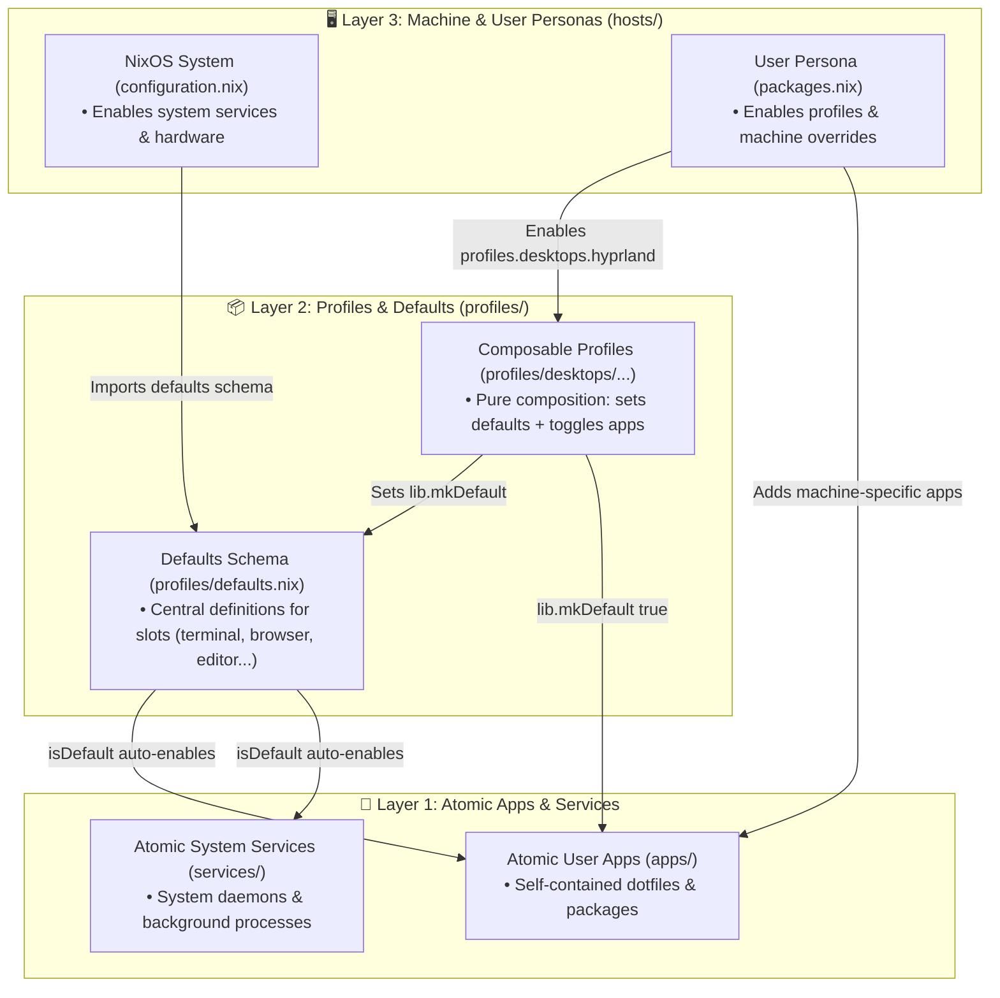

# ⏱️ Metronome — Modular NixOS & Home Manager Configuration

A clean, declarative, and **composable, role-driven** NixOS configuration powered by **Flakes** and **Home Manager**.

Rather than managing scattered package lists and disjointed boolean flags, this repository organizes the operating system around **Metronome**: a layered architecture that cleanly separates **machine-level system concerns** from **per-user environments**, while enabling flexible **reusable profiles, role-based defaults, and granular overrides**.

---

## 🏛️ The Metronome Design Philosophy

Metronome is built on four core architectural pillars:

### 1. The Clean System vs. User Split (True Multi-User Ready)
- **NixOS (`configuration.nix`) manages the Machine**:
  Hardware drivers, filesystems, networking, system daemons (`greetd`, `pipewire`, `docker`, `nginx`), and system shells (`fish`, `starship`).
- **Home Manager (`users/<name>/packages.nix`) manages the Person**:
  Desktop environment configs, user default handlers (`terminal`, `web-browser`, `file-explorer`, `text-editor`), dotfiles, and individual user tools.
- **No Hardcoded Usernames**: Apps, profiles, and services do not hardcode `/home/stranger` or `home-manager.users.${username}`. Every user profile is self-contained.

### 2. The 3-Tier Layered Model: Apps $\rightarrow$ Profiles $\rightarrow$ Personas
1. **Atomic Apps & Services (`apps/`, `services/`)**:
   Every program is packaged, configured, and scripted in its own self-contained file. Exposes a clean `enable` toggle.
2. **Profiles as Pure Composition (`profiles/`)**:
   Profiles (like `hyprland-de` or `dev.cpp`) represent complete environments. **Profiles contain no raw packages or dotfiles**—they purely compose workflows by setting recommended `metronome.defaults` and toggling `metronome.apps.*.enable = lib.mkDefault true;`.
3. **Machine & User Personas (`hosts/`)**:
   Hosts and users simply flip high-level profile toggles (`metronome.profiles.desktops.hyprland.enable = true;`), retaining full freedom to override any default or toggle extra tools.

### 3. Role-Based Defaults + App Extras Pattern
When you select a default (e.g. `defaults.terminal = "kitty"` or `defaults.desktop-environment = "hyprland"`), Metronome automatically:
1. Enables and provisions that application via `isDefault = (config.metronome.defaults.<slot> == "<app>")`.
2. Directs desktop keybindings and XDG handlers to launch it.
3. Allows installing secondary applications alongside it without changing the default (e.g. `defaults.web-browser = "google-chrome"` with `apps.firefox.enable = true`).

### 4. Nullable Defaults for Optional Tools
Essential desktop components (terminal, file manager) have defaults provided by the profile or user. Optional tool categories (like `system-monitor`) use `lib.types.nullOr` so that software like `btop` is **never installed unprompted** on minimal servers or laptops unless explicitly selected.

---

## 📐 Architecture Overview



---

## 📂 Folder Organization

```text
/etc/nixos/
├── apps/        # Atomic userland applications & dotfiles (Home Manager)
├── services/    # System-level daemons & background services (NixOS)
├── profiles/    # Reusable workflow compositions & central defaults schema
├── hosts/       # Machine-specific hardware configs & per-user personas
├── common/      # Shared universal system baselines, fonts, & locales
└── hardware/    # Modular hardware & GPU driver profiles
```

### Folder Responsibilities:

- **`apps/`**:
  Each file is a self-contained Home Manager module configuring an individual user program (e.g., Kitty, Google Chrome, Neovim, Git, MPD). All apps are automatically aggregated in `apps/default.nix`.
- **`services/`**:
  Each file is a NixOS module managing a root/systemd service (e.g., Docker, Greetd, PipeWire, Nginx, Steam, system SSH agent).
- **`profiles/`**:
  Orchestrates complete environments through **pure composition**. For example, `profiles/desktops/hyprland.nix` sets default handlers (terminal, browser, file manager) and toggles companion apps (Quickshell, Swayimg, Pavucontrol) using `lib.mkDefault`. Also contains `profiles/defaults.nix`, the central options schema for system and user slots.
- **`hosts/`**:
  Contains distinct machine profiles (`desktop`, `thinkpad-p16-gen2`). Each host defines its hardware/networking in `configuration.nix` and manages user accounts and Home Manager profiles under `users/<username>/`.
- **`common/`**:
  Universal settings shared across every machine: bootloader, weekly garbage collection, system fonts (JetBrainsMono, Noto Emoji), session variables, locales, and unified user theming ([`common/theme.nix`](file:///etc/nixos/common/theme.nix)).
- **`hardware/`**:
  Modular hardware and GPU driver configurations (`metronome.hardware.gpu = "intel" | "amd"`), alongside machine-specific hardware profiles (fans, TLP, kernel modules).

---

## 🎯 How Metronome Works in Practice

### 1. Machine Capabilities (`hosts/<host>/configuration.nix`)
In the host configuration, you declare GPU acceleration, system-wide services, and machine defaults:

```nix
metronome = {
  hardware.gpu = "intel";   # or "amd" — automatically configures VA-API, OpenCL, and diagnostic tools

  defaults = {
    display-manager = "greetd";
    web-server = "nginx";
    audio-backend = "pipewire";
    shell = "fish";
    shell-prompt = "starship";
  };

  services = {
    docker.enable = true;
    hyprland.enable = true;
    ssh.enable = true;       # Starts system-wide SSH agent socket
    steam.enable = true;
  };
};
```

### 2. User Persona via Profiles (`users/<user>/packages.nix`)
In the user's packages configuration, you enable a complete desktop environment bundle in **one line**, while easily adding extra apps or overriding defaults:

```nix
metronome = {
  # 1. Enable whole environments via profiles (pure composition):
  profiles = {
    desktops.hyprland.enable = true;
    # Automatically pulls:
    # - Defaults: Hyprland, Kitty, Chrome, Nautilus, Btop, Neovim
    # - Companion Apps: Quickshell, Swayimg, Pavucontrol, Pwvucontrol, SSH
  };

  # 2. Granular Overrides (optional):
  defaults = {
    terminal = "terminator"; # Overrides Kitty as default, keeping everything else intact!
  };

  # 3. Extra tools installed on this machine:
  apps = {
    bun.enable = true;
    direnv.enable = true;
    nodejs.enable = true;
    mpd.enable = true;

    # User-specific Git identity
    git = {
      enable = true;
      name = "Amal C.S";
      email = "amal4cs@gmail.com";
    };
  };
};
```

### 3. Desktop Appearance & Theming (`metronome.theme`)
Metronome provides a unified theming engine in [`common/theme.nix`](file:///etc/nixos/common/theme.nix). Rather than specifying low-level toolkit options (`gtk.*`, `qt.*`, `dconf.*`, `home.pointerCursor.*`), you declare high-level intent using Metronome theme tokens. Metronome automatically maps them to GTK 3/4, Qt (via GTK3 platform plugin), cursor engines (Hyprcursor, X11, Wayland), and dconf.

**Default settings applied automatically:**
* **Theme (`name`):** `adwaita-dark` (maps to `Adwaita-dark` GTK theme + `prefer-dark` color scheme)
* **Icons (`icons`):** `papirus-dark` (maps to `Papirus-Dark` icon theme from `papirus-icon-theme`)
* **Cursor (`cursor`):** `nordzy` (maps to `Nordzy-cursors` for GTK/X11, `Nordzy-hyprcursors` for Hyprcursor from `nordzy-cursor-theme`)
* **Cursor Size (`cursor-size`):** `24`
* **Qt integration:** Automatically configured with `platformTheme.name = "gtk3"` to match the desktop GTK theme
* **Nautilus view:** Icon view, directories sorted first

**Customizing / overriding themes per user:**
Users can override any theme preset in their `packages.nix` or `users/<user>/theme.nix`:

```nix
metronome.theme = {
  name = "tokyo-night";  # Presets: "adwaita-dark", "adwaita-light", "tokyo-night", "nord"
  icons = "papirus-dark"; # Presets: "papirus-dark", "papirus-light", "adwaita"
  cursor = "nordzy";      # Presets: "nordzy", "adwaita"
  cursor-size = 24;
};
```

---

## 🚀 Rebuilding & System Commands

```bash
# Rebuild ThinkPad
sudo nixos-rebuild switch --flake /etc/nixos#thinkpad-p16-gen2

# Rebuild Desktop
sudo nixos-rebuild switch --flake /etc/nixos#desktop

# Check syntax & update inputs
nix flake check
nix flake update

# Storage maintenance
sudo nix-collect-garbage --delete-older-than 7d
nix store optimise
```
