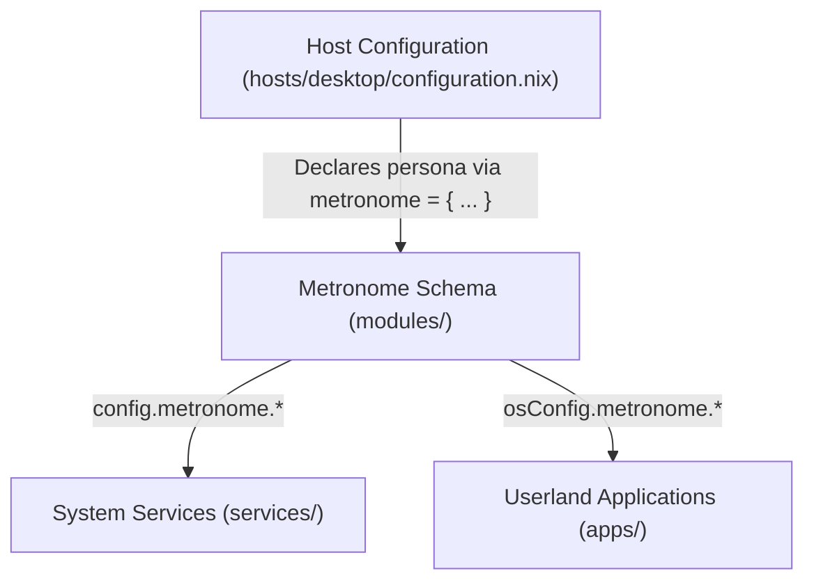

# WORK IN PROGRESS
# ⏱️ Metronome — Modular NixOS & Home Manager Configuration

A clean, declarative, and hierarchical NixOS configuration powered by **Flakes** and **Home Manager**.

Rather than managing scattered package lists and disjointed boolean flags, this repository organizes the entire operating system around **Metronome**: a unified, intent-driven schema that bridges low-level NixOS system services and high-level Home Manager user environments.

---

## 🏛️ The Metronome Architecture

Metronome establishes a **functional classification taxonomy** for systems. You declare the high-level intent and persona of a machine in its host configuration, and both system-level daemons and user-level applications automatically orchestrate themselves.



### Core Architecture Layers:

1. **`modules/` (The Metronome Schema)**: Defines the hierarchical options under `options.metronome.*` (window managers, terminal stack, dev runtimes, audio, system monitors, file managers).
2. **`hosts/` (The Machine Personas)**: Each host configures its role by toggling high-level Metronome categories (e.g. a power workstation vs. a minimalist laptop).
3. **`services/` (System-Level Realization)**: NixOS modules that read `config.metronome.*` to provision root services, system daemons, display managers, and audio servers.
4. **`apps/` (User-Level Realization)**: Home Manager modules that read `osConfig.metronome.*` to install user packages, deploy dotfiles, and wire toolchains.
5. **`common/` (Foundations)**: Shared baselines across every machine (bootloader, Nix settings, GC, locales, base utilities).
6. **`hardware/` (Hardware Profiles)**: Hardware-specific driver profiles (e.g., AMD GPU, OpenCL, Mesa).
7. **`users/` (Identity SSOT)**: Centralized user metadata (username, full name, email) injected into both NixOS and Home Manager.

---

## 📂 Repository Layout

```text
.
├── flake.nix                          # Master orchestrator: inputs, host declarations, and user bindings
├── flake.lock                         # Pinned dependency lockfile ensuring reproducible builds
├── hardware-configuration.nix         # Auto-generated hardware detection for target system
├── README.md                          # Repository documentation and architectural guide
│
├── modules/                           # Metronome schema definitions (options.metronome.*)
│   ├── default.nix                    # Module aggregation entry point
│   ├── window_manager.nix             # Window manager selection (hyprland, gnome, kde, none)
│   ├── display-manager.nix            # Display manager selection (greetd, sddm, none)
│   ├── audio.nix                      # Audio backend selection (pipewire, none)
│   ├── terminal.nix                   # Terminal emulator, shell, and prompt options
│   ├── editor.nix                     # Editor preferences (neovim, vim, nano)
│   ├── ai.nix                         # AI & LLM engine capabilities
│   ├── containers.nix                 # Container runtime configurations
│   ├── games.nix                      # Gaming and hardware integration options
│   ├── networking/                    # Network daemons and proxies
│   │   ├── default.nix
│   │   └── http-server.nix            # HTTP server selection (nginx, apache)
│   └── dev/                           # Development toolchain taxonomies
│       ├── default.nix                # Dev modules aggregator
│       ├── typescript.nix             # TypeScript/JavaScript runtimes (nodejs, bun)
│       └── cxx.nix                    # C/C++ toolchains, build systems, and debuggers
│
├── hosts/                             # Machine-specific host configurations
│   └── desktop/                       # Workstation host profile ("nixos")
│       ├── configuration.nix          # Host entry point declaring the Metronome persona
│       ├── hardware.nix               # Hardware profile links (GPU, CPU)
│       └── filesystem.nix             # File systems, Btrfs subvolumes, and swap configuration
│
├── services/                          # System-level services and daemons (NixOS)
│   ├── default.nix                    # Services aggregator
│   ├── hyprland.nix                   # System-level Hyprland compositing, polkit, portals
│   ├── pipewire.nix                   # PipeWire, WirePlumber, dynamic sample rate switching
│   ├── greetd.nix                     # Lightweight tuigreet display manager
│   ├── docker.nix                     # Container runtime daemon
│   ├── nginx.nix                      # Web server daemon
│   ├── ollama.nix                     # Ollama LLM inference service
│   ├── postgresql.nix                 # Relational database service
│   └── steam.nix                      # Steam hardware integration & firewall rules
│
├── apps/                              # User-level applications and dotfiles (Home Manager)
│   ├── default.nix                    # Applications aggregator
│   ├── hyprland/                      # Hyprland user configuration (hyprland.lua, keybinds, theme)
│   ├── kitty/                         # Kitty terminal emulator config and styling
│   ├── neovim/                        # Neovim plugins, language servers, and Lua config
│   ├── swayimg/                       # Lightweight image viewer with custom bindings
│   ├── fish.nix                       # Fish shell configuration and integrations
│   ├── starship.nix                   # Starship prompt configuration
│   ├── git.nix                        # Git client, aliases, and user metadata
│   ├── direnv.nix                     # Direnv + nix-direnv shell integration
│   ├── btop.nix                       # TUI system monitor
│   ├── bun.nix                        # Bun JavaScript runtime
│   ├── nodejs.nix                     # Node.js JavaScript runtime
│   ├── google-chrome.nix              # Web browser
│   ├── mpv.nix                        # Hardware-accelerated media player
│   ├── posting.nix                    # TUI HTTP/REST client
│   ├── thunar.nix                     # Graphical file manager
│   ├── nautilus.nix                   # GNOME file manager
│   ├── pavucontrol.nix                # PulseAudio / PipeWire volume control
│   └── pwvucontrol.nix                # PipeWire native volume control
│
├── common/                            # Shared universal configurations
│   ├── nixos.nix                      # Bootloader (systemd-boot), Nix flakes, weekly GC
│   ├── home.nix                       # Universal Home Manager baseline
│   ├── packages.nix                   # Core utilities (curl, wget, jq, btrfs-progs) & fonts
│   ├── services.nix                   # Essential shared services (NetworkManager, Udisks2, GVFS)
│   ├── env_variables.nix              # Global environment variables
│   ├── xdg.nix                        # Standard XDG user directories layout
│   ├── ssh-key.nix                    # Auto-generated Ed25519 user keys & SSH agent
│   └── locale/
│       └── india.nix                  # Timezone (Asia/Kolkata) & locale formatting
│
├── hardware/                          # Modular hardware definitions
│   └── gpu/
│       └── radeon.nix                 # AMD GPU Mesa drivers, Vulkan, OpenCL, amdgpu_top
│
└── users/                             # User identity declarations (SSOT)
    └── stranger.nix                   # User identity, system groups, and login shell
```

---

## 🎯 How Metronome Works in Practice

Machines are configured by declaring their functional classification under `metronome` in `hosts/<machine>/configuration.nix`.

### Example 1: High-Performance Developer Workstation
```nix
# hosts/desktop/configuration.nix
metronome = {
  window_manager = "hyprland";
  display_manager = "greetd";

  audio.backend = "pipewire";

  terminal = {
    emulator = "kitty";
    shell = "fish";
    prompt = "starship";
  };

  editors = {
    neovim.enable = true;
    default = "neovim";
  };

  dev = {
    cxx.enable = true;
    typescript = {
      enable = true;
      runtimes = [ "nodejs" "bun" ];
    };
  };

  containers.enable = true;
  containers.docker.enable = true;

  networking.http_server = {
    enable = true;
    backend = "nginx";
  };

  ai = {
    enable = true;
    engine.ollama.enable = true;
  };

  games = {
    enable = true;
    steam.enable = true;
  };
};
```

### Example 2: Minimalist Family Laptop
Because Metronome isolates capabilities, configuring a simple, bloat-free system for another user requires only toggling the categories:
```nix
# hosts/laptop/configuration.nix
metronome = {
  window_manager = "gnome";            # Stable, familiar desktop
  display_manager = "sddm";

  terminal = {
    emulator = "none";                 # Uses GNOME Terminal defaults
    shell = "bash";
    prompt = "none";
  };

  editors = {
    neovim.enable = false;             # No developer editors
    default = "nano";
  };

  dev = {
    cxx.enable = false;                # Zero compilers or debuggers installed
    typescript.enable = false;         # No Node.js / Bun
  };

  containers.enable = false;           # No Docker
  networking.http_server.enable = false;
  ai.enable = false;                   # No LLM engines
  games.enable = false;                # No gaming dependencies
};
```

---

## 🔧 Adding New Capabilities to Metronome

When adding an application or daemon to your system, follow the three-step Metronome pattern:

1. **Define the Option** in `modules/`:
   Add a classification option (e.g. `options.metronome.system_monitor = lib.mkOption { ... };` or `options.metronome.gaming.steam.enable = lib.mkEnableOption ...;`).
2. **Implement the Target**:
   - For **user apps/tools**: Create `apps/<name>.nix` using `lib.mkIf (osConfig.metronome.<category> == "<name>")` and import it into `apps/default.nix`.
   - For **system services**: Create `services/<name>.nix` using `lib.mkIf (config.metronome.<category> == "<name>")` and import it into `services/default.nix`.
3. **Select it in Host**:
   Toggle the option in `hosts/<hostname>/configuration.nix`.

---

## 🚀 Rebuilding & Maintenance

### Apply System Changes
```bash
sudo nixos-rebuild switch --flake /etc/nixos#nixos
```

### Check Flake & Syntax
```bash
nix flake check
```

### Update Flake Dependencies
```bash
nix flake update
```

### Clean Old Generations & Optimize Store
```bash
sudo nix-collect-garbage --delete-older-than 7d
nix store optimise
```
